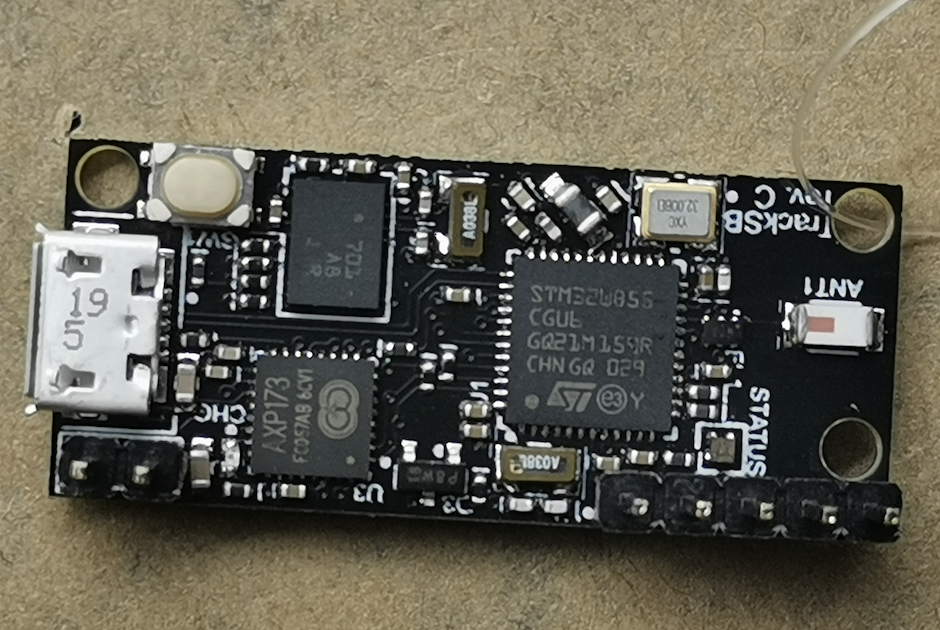

### `tracksb`

A DIY, IMU-based skateboard activity tracker. The idea is to come up with algorithms
to track activity during skateboarding sessions.

A companion mobile app could be used to get useful insights into the session.

#### Board

The current revision is `C`. It uses:

* [STM32WB55](https://www.st.com/en/microcontrollers-microprocessors/stm32wb55rg.html)
  ([hal](https://github.com/eupn/stm32wb-hal)) as a Cortex-M4F + Bluetooth (BLE) microcontroller
* [BNO08x](https://www.ceva-dsp.com/product/bno080-085/)
  ([driver](https://github.com/tstellanova/bno080)) as an all-in-one IMU with an accelerometer, gyroscope and magnetometer
  together with a built-in sensor fusion algorithm
* [AXP173](http://www.x-powers.com/en.php/Info/product_detail/article_id/27)
  ([driver](https://github.com/eupn/axp173-rs)) as a Li-Po battery charging, power-path and gas gauge controller
  

  
Revision C board picture

  

A link to [Upverter Design](https://upverter.com/design/ep/2dfdd177c0e55fc7/tracksb-stm32wb---rev-c/)
for schematic and PCB layout.

#### Firmware

Firmware is written in Rust, currently it's very minimal and can't do much.
It can be found in [firmware](firmware) directory.

It's built with [RTIC](https://rtic.rs) and uses [probe-run](https://github.com/knurling-rs/probe-run)
for board flashing and debugging via RTT logging.

##### Firmware TODO List

- [x] Stream quaternions via USB virtual serial port
- [ ] Fancy PWM for RGB LED instead of simple on/off
- [ ] Use interrupts for PMIC and IMU interaction
- [ ] Use `async/.await`, especially for BLE
- [ ] Integrate with BLE support from [stm32wb55](https://github.com/eupn/stm32wb55) crate
  - [ ] Create a simple GATT service for rotation quaternions streaming
- [ ] Optimize power consumption and low-power modes
