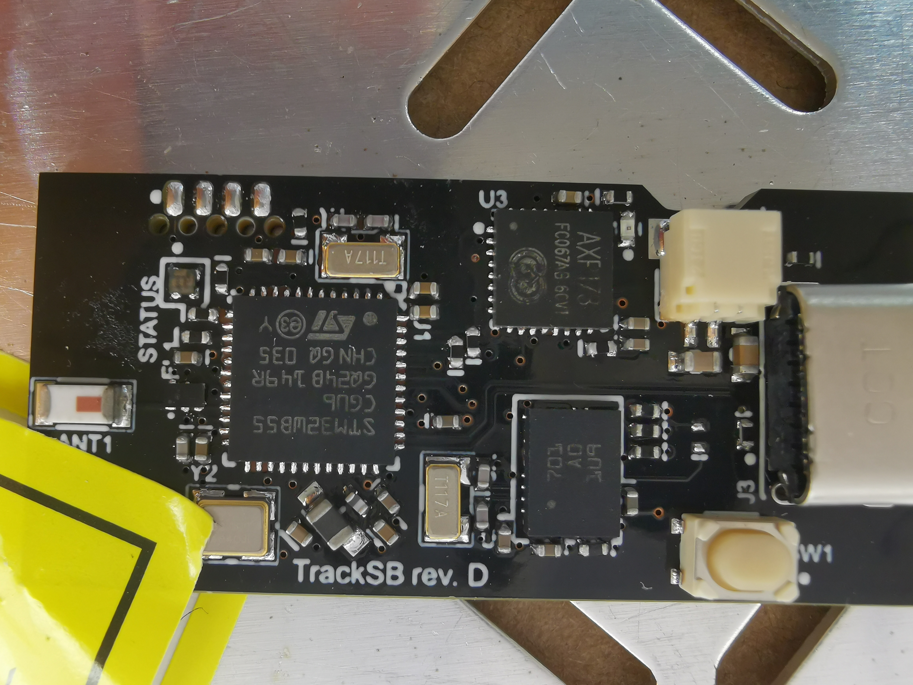
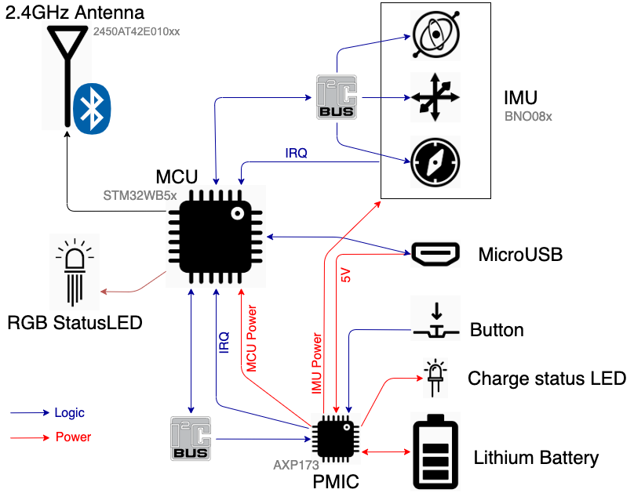

### `tracksb`

A DIY, IMU-based skateboard activity tracker. The idea is to come up with algorithms
to track activity during skateboarding sessions.

A companion mobile app could be used to get useful insights into the session.

#### Board

The current revision is `D`. It uses:

* [STM32WB55](https://www.st.com/en/microcontrollers-microprocessors/stm32wb55rg.html)
  ([hal](https://github.com/eupn/stm32wb-hal)) as a Cortex-M4F + Bluetooth (BLE) microcontroller
* [BNO08x](https://www.ceva-dsp.com/product/bno080-085/)
  ([driver](https://github.com/tstellanova/bno080)) as an all-in-one IMU with an accelerometer, gyroscope and magnetometer
  together with a built-in sensor fusion algorithm
* [AXP173](http://www.x-powers.com/en.php/Info/product_detail/article_id/27)
  ([driver](https://github.com/eupn/axp173-rs)) as a Li-Po battery charging, power-path and gas gauge controller
* [Type-C USB Port](https://gct.co/files/drawings/usb4085.pdf) for charging & optional USB data/DFU
* [SOICbite](https://github.com/SimonMerrett/SOICbite) programming port suitable for fast and convenient programming & debugging of the device firmware with  a standard SOIC-8 clip

  
Revision D board picture

  

A link to [Upverter Design rev. D](https://upverter.com/design/ep/13d0e37f71522631/)
for schematic and PCB layout.

  
Device System Diagram

  

#### Firmware

Firmware is written in Rust, currently it's very minimal and can't do much.
It can be found in [firmware](firmware) directory.

It's built with [RTIC](https://rtic.rs), [`embassy`] and uses [probe-run](https://github.com/knurling-rs/probe-run)
for board flashing and debugging via RTT logging.

##### Firmware TODO List

Here are some stuff that should be done or improved, in no particular order.

- [x] Validate and fix IMU axes and quaternion data
- [x] Use interrupts for communication with PMIC and IMU
  - [x] Poll IMU via interrupt
  - [x] Use interrupt for PMIC status updates (charging, button, etc.)
  - [x] `async/.await` for interrupts
- [x] Use async I/O for I2C comm with PMIC & IMU
  - [x] `async` DMA I2C
- [ ] Bluetooth features
  - [x] Integrate BLE support from [stm32wb55](https://github.com/eupn/stm32wb55) crate
  - [x] `async/.await` BLE
    - Powered by [`embassy`]. Upstream PR is [#24](https://github.com/akiles/embassy/pull/24)
  - [x] BLE
    - [x] Stream quaternions via GATT service with one characteristic
    - [x] Stream accelerometer and gyroscope data
    - [x] Battery level service
      - [x] Fix race condition against PMIC (access PMIC exclusively from one task?)
      - [x] Fix being locked on BLE mutex if there's no motion data events (IMU disabled)
    - [ ] Device Info Service
  - [ ] Cleanup `static mut` and `unsafe` code
    - [x] Use async mutex for resources shared between tasks
      - [x] [`futures-intrusive`](https://crates.io/crates/futures-intrusive)?
- [x] PMIC
  - [x] Implement battery gas gauge via built-in coulomb counters
- [x] Flash RGB LED instead of simple on/off
  - [x] Simple flash
  - [x] Red light on HardFault
  - [x] PWM effects
- [ ] Optimize power consumption and use low-power modes
  - [x] Fix debugging/RTT in sleep mode
  - [x] LPTIM-based delays instead of dumb loops
  - [ ] Enter Low-Power mode in async executor loop
  - [ ] Detect when device is IDLE and scale down the IMU frequency
  - [ ] Asynchronously wait for the PMIC to appear on I2C bus on the very first start (battery just plugged)
    - [x] Async I2C retry
    - [ ] Wait for `PWROK` interrupt
- [x] Non-Volatile Logging
  - [x] Persist panic messages
  - [x] Persist `defmt` logs (powered by [`defmt-persist`])
  - [x] A simple way to download and read logs & postmortems (done with [`probe-rs`] + [`defmt-print`])

#### Software

- A BLE client for PC that logs received data is [here](ble-quaternions-listener)
- A Processing sketch that visualise data is [here](tracksbvis)

### Device and board orientation

  
Intended axes orientation and position of the device

[`embassy`]: https://github.com/akiles/embassy
[`defmt-persist`]: https://github.com/BlackbirdHQ/defmt-persist
[`probe-rs`]: https://github.com/probe-rs/probe-rs
[`defmt-print`]: https://github.com/eupn/defmt-print
